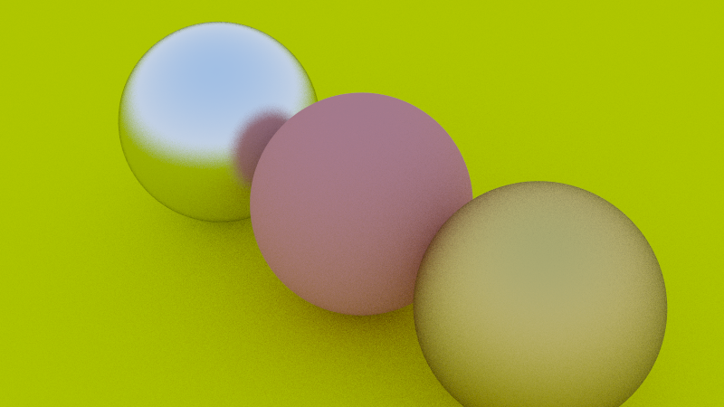

# Parallel Ray Tracer

A parallel ray tracer implemented in Rust, based on the "Ray Tracing in One Weekend" series by Peter Shirley.

## Example Output

*Example render showing three spheres with different materials: metallic (left), diffuse (center), and gold-like metal (right)*

## Features

- Basic ray tracing with spheres, cameras, and materials
- Support for diffuse (Lambertian) and reflective (Metal) materials
- Anti-aliasing using random sampling
- Multi-threaded rendering using Rayon for parallelism
- Output to PNG files using the image crate

## Requirements

- Rust (stable version recommended)
- Dependencies: rayon, rand, image (see Cargo.toml)

## Building and Running

```bash
# Clone the repository
git clone https://github.com/abdo544445/parallel-raytracer-rs.git
cd parallel-raytracer-rs

# Build
cargo build --release

# Run
cargo run --release
```

The rendered image will be saved as `output.png` in the project directory.

## Project Structure

- `main.rs`: Entry point, scene setup, and render loop
- `camera.rs`: Camera and ray generation
- `color.rs`: Color utilities and output
- `hits.rs`: Ray-object intersection handling
- `material.rs`: Material definitions (Lambertian, Metal)
- `objects.rs`: Geometric objects (Sphere)
- `ray.rs`: Ray implementation
- `vec3.rs`: Vector math utilities

## Extending the Project

Possible enhancements:
- Add dielectric (glass-like) materials with refraction
- Support for additional primitives (planes, triangles, meshes)
- Depth of field effect
- Motion blur
- Scene loading from files

## License

Not configured yet

